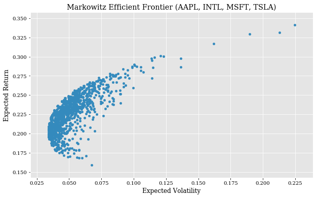

# Markowitz_Portfolio_Optimization_AAPL_MSFT_INTC_TSLA

## The problem definition: 
    With new tech companies emerging everyday, which four companies should I
    build my Tech Portfolio with? Given those four choosen, how can I optimize
    this portfolio to maximize returns, while minimizing total cost?

## Research:
    Using the same practices as Warren Buffet to choose his core holdings
    (foundation of a portfolio) of choosing long intrenched and strong core
    hodlings (i.e. Coca-cola, IBM, American Express). Since I am looking to 
    build a portfolio with tech based core holdings I am going to look at three
    which have been around for a while, building/inovating new
    tech that we use everyday, and have had a strong stable performance/growth 
    over time: Microsoft, Intel, and Apple Inc.  
    
    For the fourth core holding I have choosen Tesla Inc, due to its prowess 
    in the new inovative auto technologies and that SpaceX is boosting reliability
    of Elon Musks tech muscles along with the fact that I cannot directly 
    invest in SpaceX yet and would have to invest in compaies that produce
    materials or are sending up sateliets and plan to use SpaceX to do it, I 
    believe that by investing in Tesla Inc, it will be the closet to gaining
    a reward from the performance of SpaceX. This is definitly a 10+ year 
    risk/reward investment. 
    
## Solution:
    This program looks to analyis a portfolio built upon the core holdings of:
    Microsoft (MSFT), Apple Inc. (AAPL), Intel (INTC), and Tesla Inc. (TSLA).  
    
    Then optimize this portfolio to produce the maximum return on my investment,
    while minimizing my total cost.   
    
    By calculating the rate of a return of a portfolio that contains these four
    secruities, we can find the histociral rate of return (expected rate) from 
    this portfolio in the future.   
    
    We will calculate the rates of return for each individual security and
    multiply this by the weight it has in the overall portfolio.   
        
        sum(rate of return for a security_i * weight in portfolio_i)
        for i = 1,...,4  
    
    Fo an equally weighted portfolio, this would mean in our case that
    each stock has a weight of 25% since:  
        
                     sum(APPL return * 25%,
                         MSFT return * 25%,
                         INTL return * 25%,
                         TSLA return * 25%)  
                        
    The sum of these return would be the rate of the return for the portfolio.  
    
    Since, we are looking to optimize our portfolio the weights will vary. The
    calculation will be the same, but will the different weights. For example,
    APPL 35%, MSFT 25%, INTL 15%, TSLA 25%:  
              
                      sum(APPL return * 35%,
                          MSFT return * 25%,
                          INTL return * 15%,
                          TSLA return * 25%)  
                          
                          
    To figure out the optimal combination we will run simulation of 1000 different 
    combinations of weights to obtain the Markowitz Efficient Frontier. This will 
    allow us to choose the portfolio with the combination of weights that produces
    the lowest expected volatility and the highest expected return.
    
  

<a href="https://obrianbl.github.io/">Return to Main Page</a>
